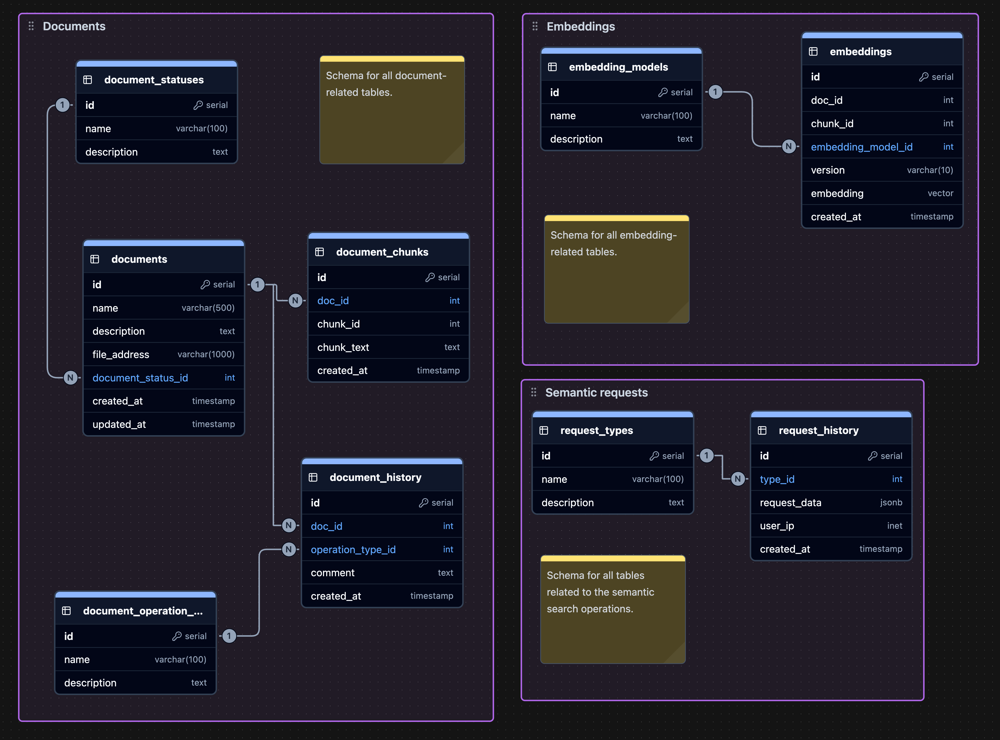
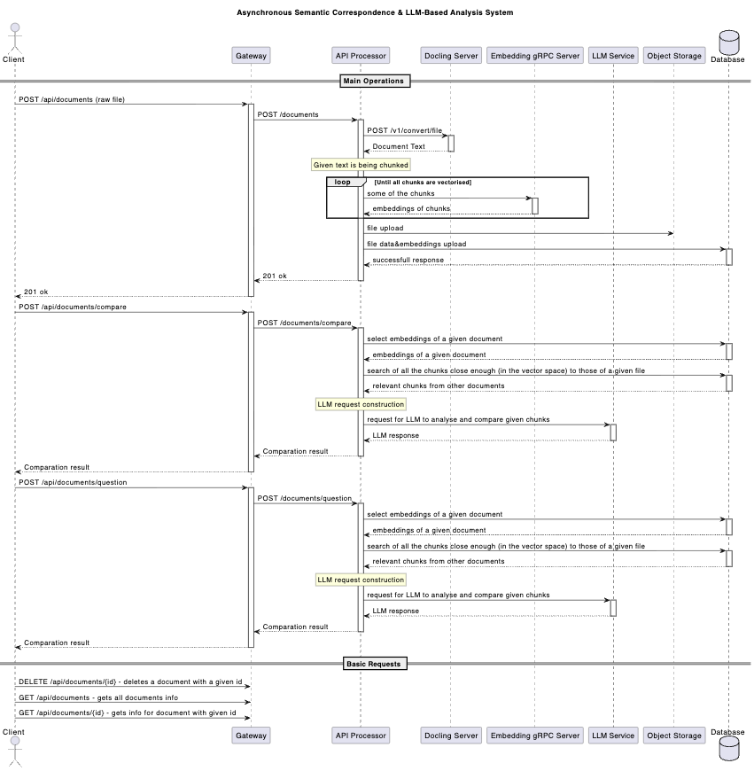

# Project overview 
That project is a RAG system for document knowledge bases. 
Its killer feature is the ability to compare one document to all other documents from the knowledge base simulataneously to find possible contradictions.  

# High-level design shcema

# Database Schema 

# UML sequence 

